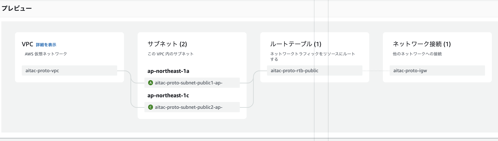

# aws aitac
proto用の環境構築メモ(超簡易版)

## 準備

一旦VPC内にパブリックサブネットを作成、セキュリティグループでグローバルIPでアクセスを絞る。  
パブリックサブネット内にRDBを作成して、クライアントPCからアクセスできるようにする。

### VPC

「vpcなどを作成」で一気につくってしまう  
設定は以下  

- 名前タグ: aitac-proto
- IPv4 CIDR: 10.0.0.0/16
- IPv6 CIDR: なし
- az: `ap-northest-1a/1c`
- パブリックサブネット: 2
- プライベートサブネット: 0

### seg grp

任意のwebサービスでグローバルIPをしらべて、セキュリティグループを自宅のグローバルIPに絞る

### DB

- DB: MySQL
- テンプレート: 開発/テスト
- 認証情報管理: セルフマネージド(パスワードを自分で入力)
- 可用性: 単一の DB インスタンス
- 識別子: aitac-proto
- パブリックアクセス: あり
- 追加設定: DB名 `AitacProtoDB`
